# System design

## Table of Contents
  1. [Use case diagram](#1)  
  2. [Activity diagram](#2)  
     2.1 [Sign up](#2.1)  
     2.2 [Sign in](#2.2)  
     2.3 [Writing an article](#2.3)  
     2.4 [Information rating](#2.4)  
     2.5 [Information search](#2.5)  
  3. [Sequence diagram](#3)  
     3.1 [Sign in](#3.1)  
     3.2 [Writing an article](#3.2)  
     3.3 [Writing a comment](#3.3)  
     3.4 [Information rating](#3.4)  
  4. [Class diagram](#4)  
  5. [State diagram](#5)  
     5.1 [Sign up](#5.1)  
     5.2 [Sign in](#5.2)  
     5.3 [Writing an article](#5.3)  
     5.4 [Information rating](#5.4)  
     5.5 [Information search](#5.5)  
  6. [Component diagram](#6)  
  7. [Deployment diagram](#7)  

## 1 Use case diagram

The glossary, actors and scenarios for each use case are described in [separate document](UseCase/UseCase-en.md).

## 2 Activity diagram
### 2.1 Sign up 
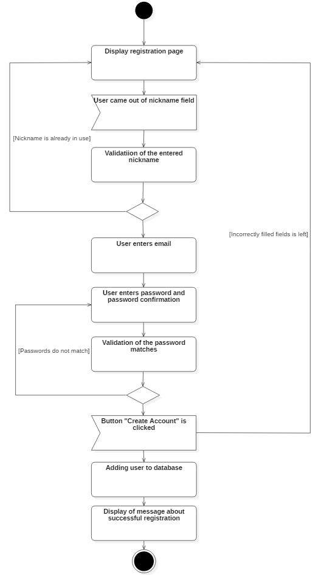

---

### 2.2 Sign in
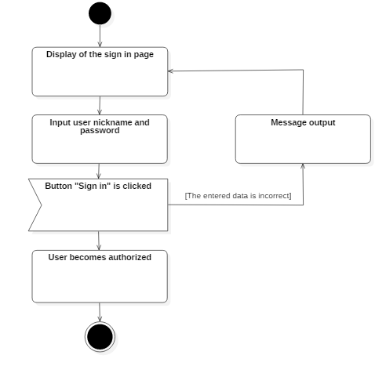

---

### 2.3 Writing an article
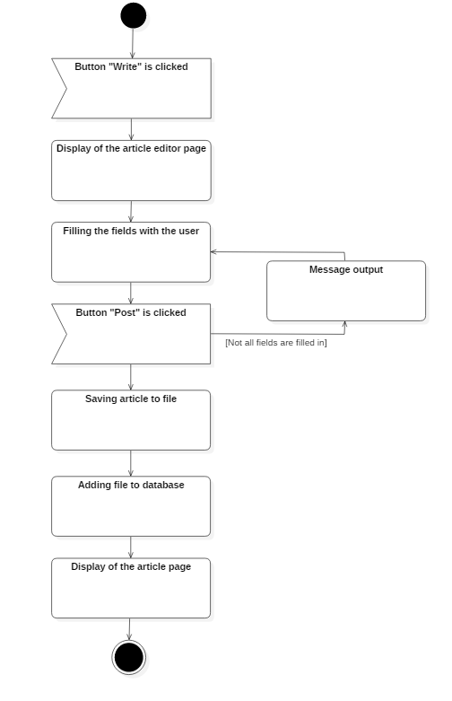

---

### 2.4 Information rating
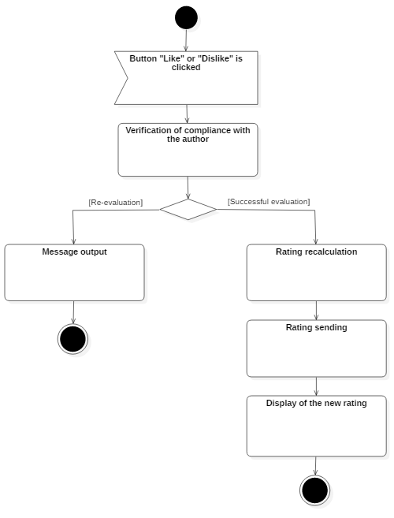

---

### 2.5 Information search
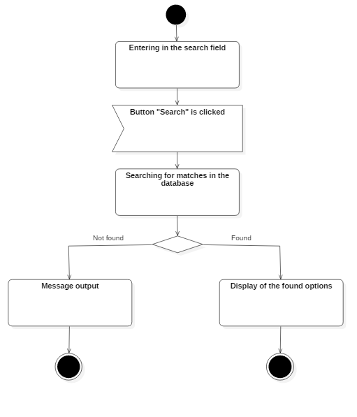

## 3 Sequence diagram
### 3.1 Sign in 

---

### 3.2 Writing an article

---

### 3.3 Writing a comment
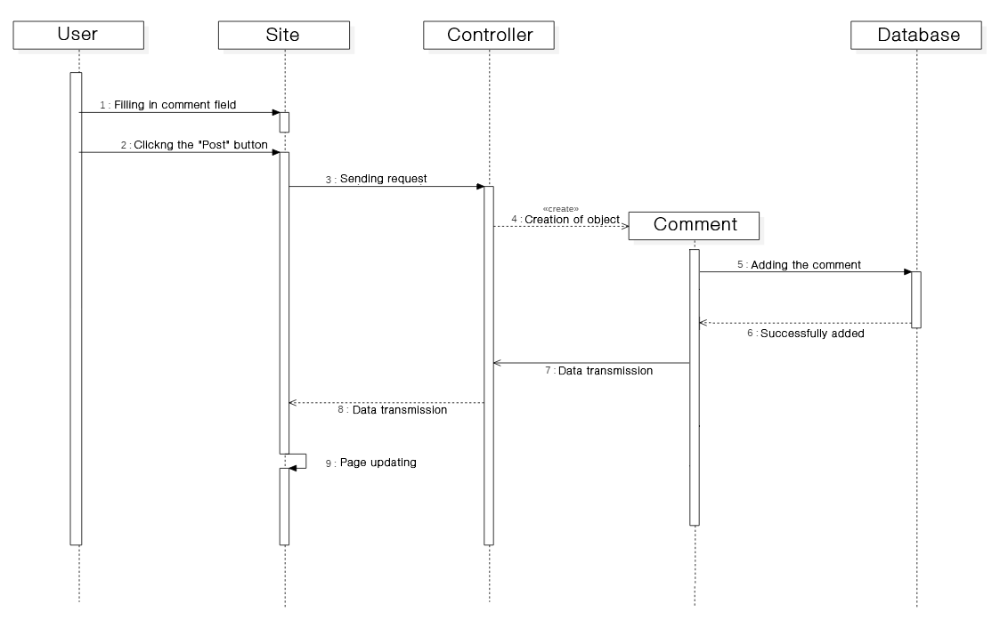

---

### 3.4 Information rating
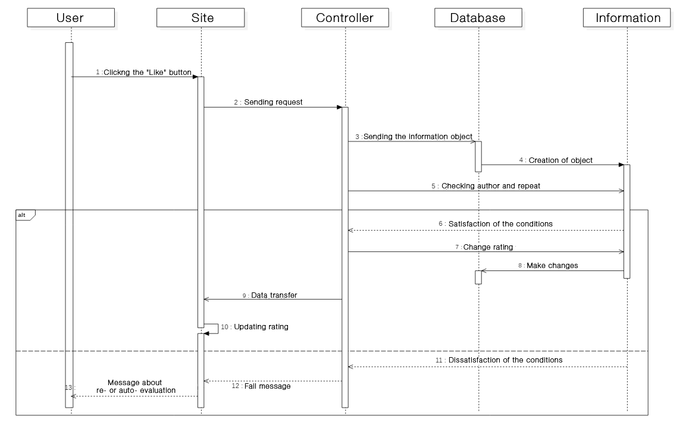

## 4 Class diagram
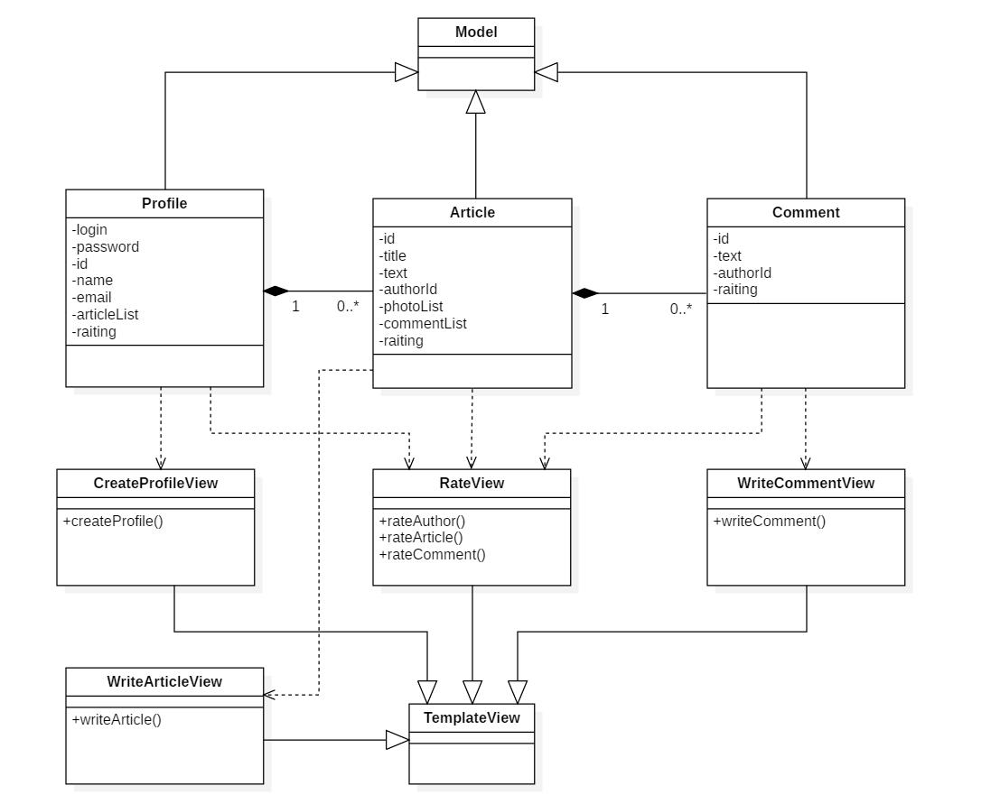

## 5 State diagram
### 5.1 Sign up 
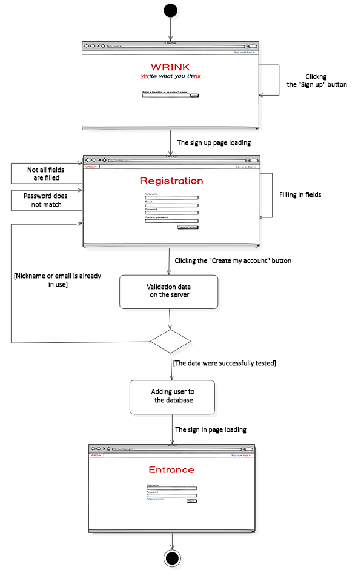

---

### 5.2 Sign in
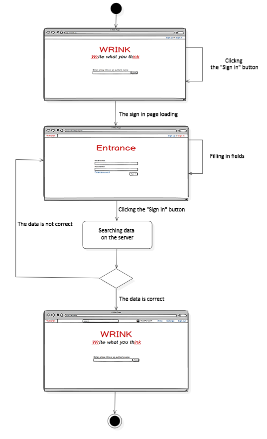

---

### 5.3 Writing an article
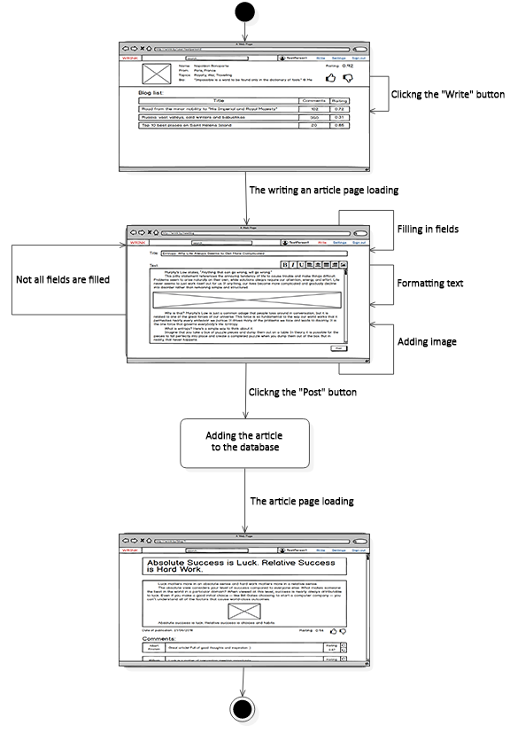

---

### 5.4 Information rating
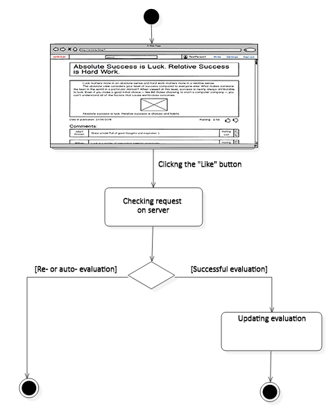

---

### 5.5 Information search
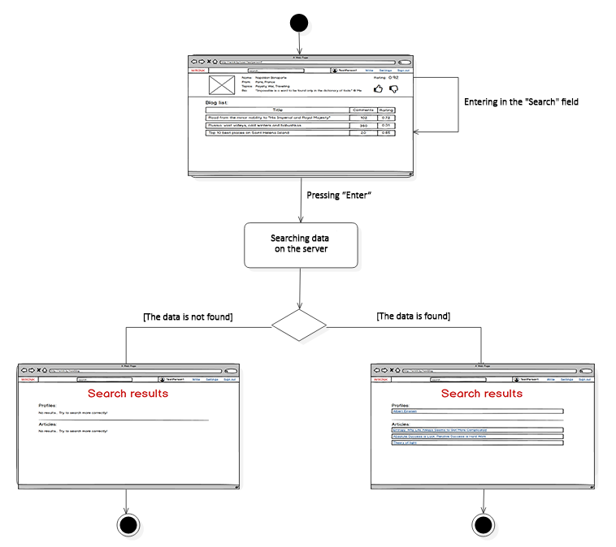

## 6 Component diagram

## 7 Deployment diagram

