# Поектирование системы

## Содержание
  1. [Диаграмма вариантов использования](#1)  
  2. [Диаграммы активностей](#2)  
     2.1 [Регистрация](#2.1)  
     2.2 [Вход в систему](#2.2)  
     2.3 [Написание статьи](#2.3)  
     2.4 [Оценка информации](#2.4)  
     2.5 [Поиск информации](#2.5)  
  3. [Диаграмма последовательности](#3)  
     3.1 [Вход в систему](#3.1)  
     3.2 [Написание статьи](#3.2)  
     3.3 [Написание комментария](#3.3)  
     3.4 [Оценка информации](#3.4)  
  4. [Диаграмма классов](#4)  
  5. [Диаграммы состояний](#5)  
     5.1 [Регистрация](#5.1)  
     5.2 [Вход в систему](#5.2)  
     5.3 [Написание статьи](#5.3)  
     5.4 [Оценка информации](#5.4)  
     5.5 [Поиск информации](#5.5)  
  6. [Диаграмма компонентов](#6)  
  7. [Диаграмма развёртывания](#7)  

## 1 Диаграмма вариантов использования
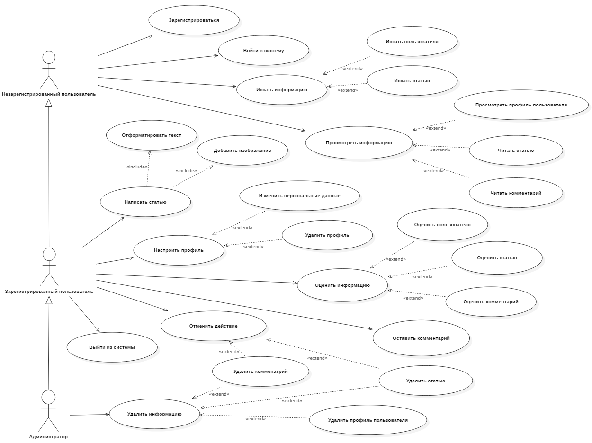
Глоссарий, актёры и сценарии для каждого варианта использования описаны в [отдельном документе](UseCase/UseCase-ru.md).

## 2 Диаграммы активностей
### 2.1 Регистрация 
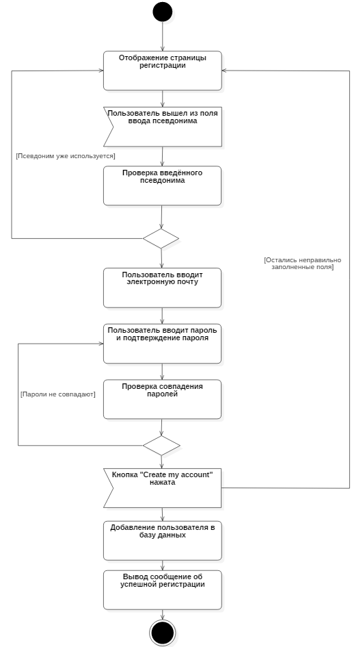

---

### 2.2 Вход в систему
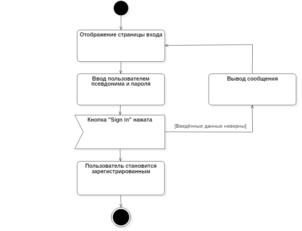

---

### 2.3 Написание статьи
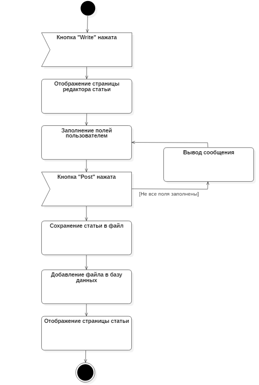

---

### 2.4 Оценка информации

---

### 2.5 Поиск информации
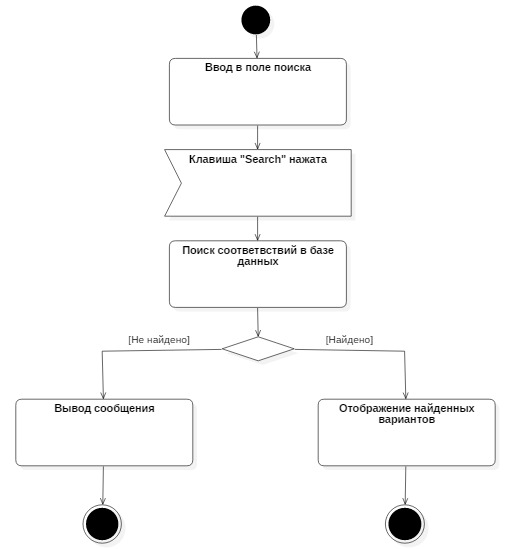

## 3 Диаграмма последовательности
### 3.1 Вход в систему 
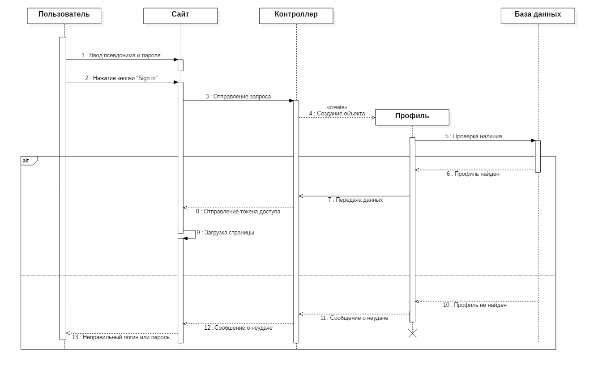

---

### 3.2 Написание статьи
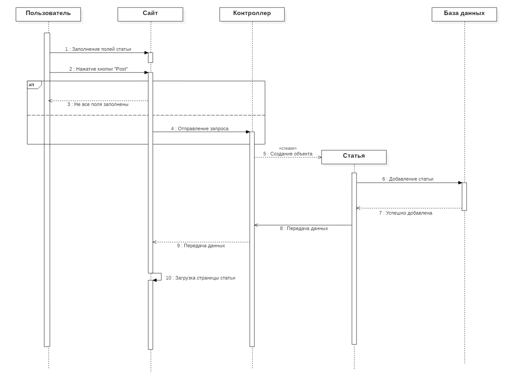

---

### 3.3 Написание комментария
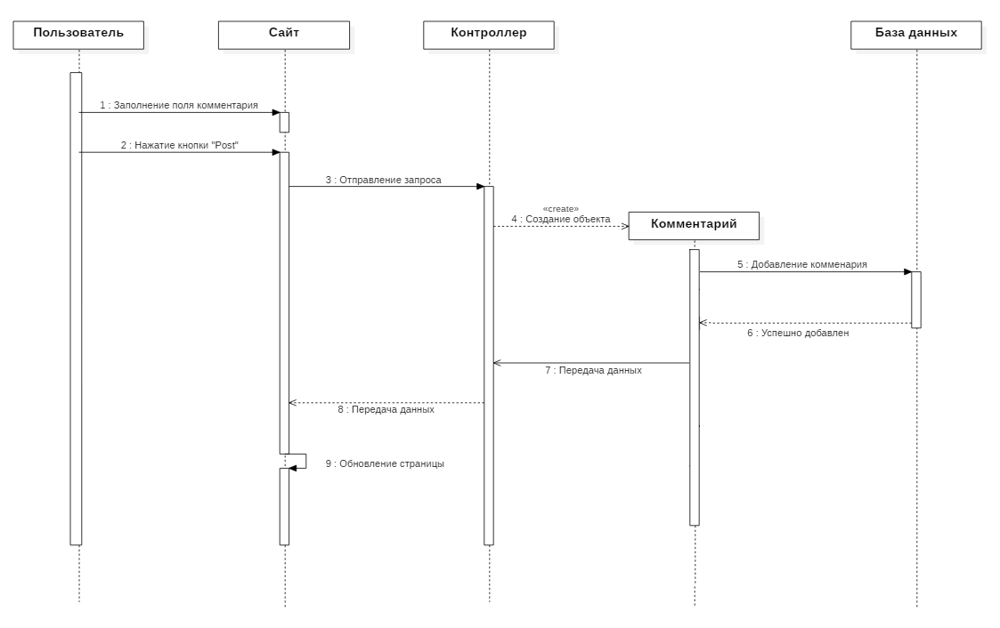

---

### 3.4 Оценка информации
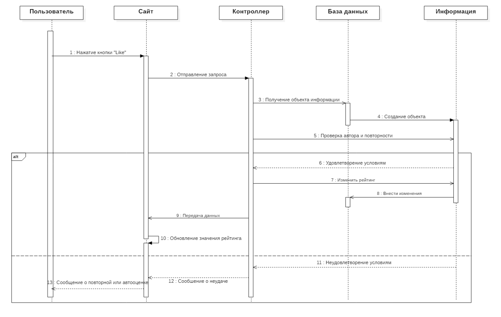

## 4 Диаграмма классов

## 5 Диаграммы состояний
### 5.1 Регистрация 
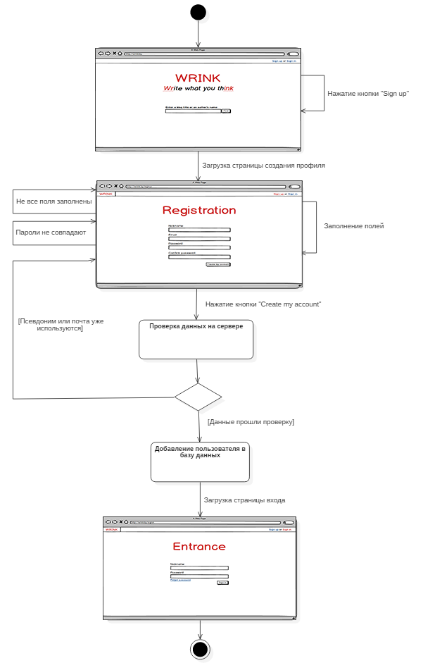

---

### 5.2 Вход в систему
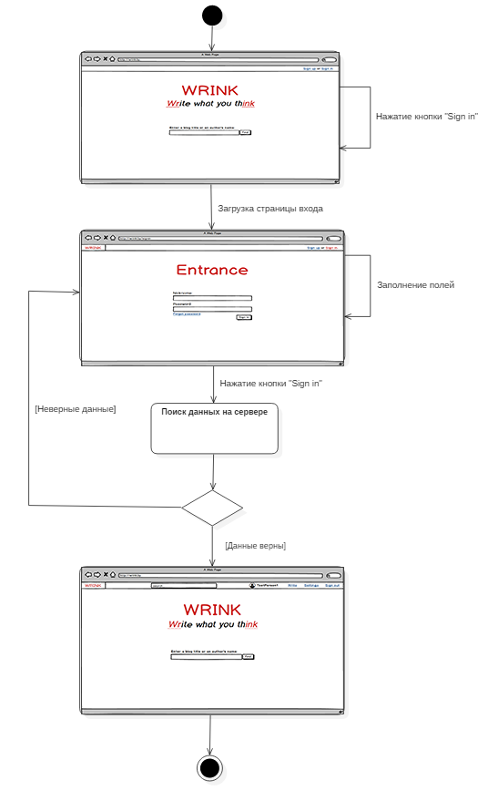

---

### 5.3 Написание статьи
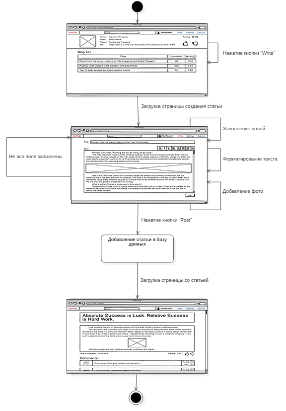

---

### 5.4 Оценка информации
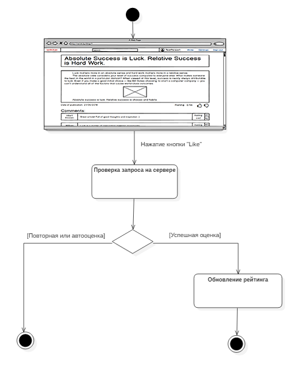

---

### 5.5 Поиск информации
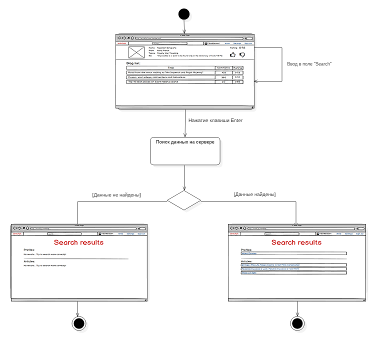

## 6 Диаграмма компонентов
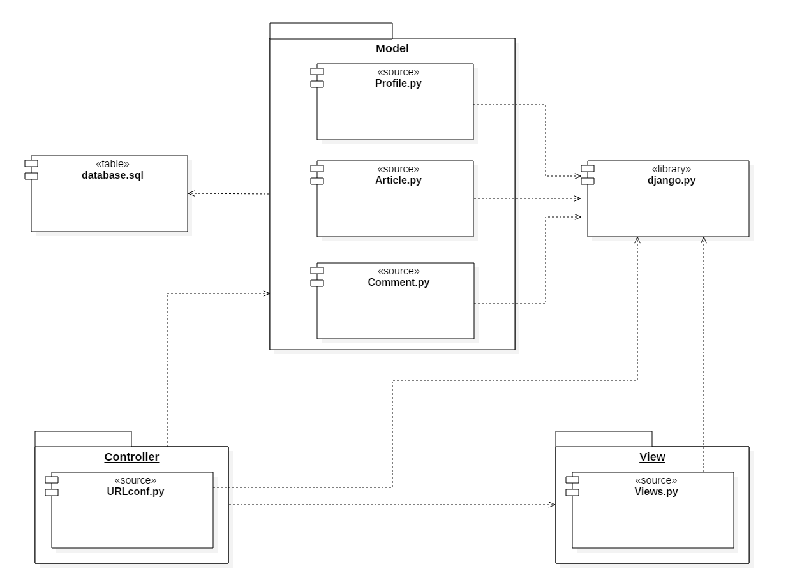

## 7 Диаграмма развёртывания
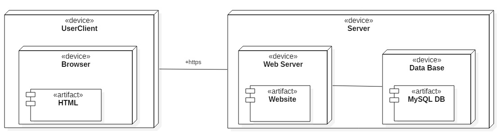
