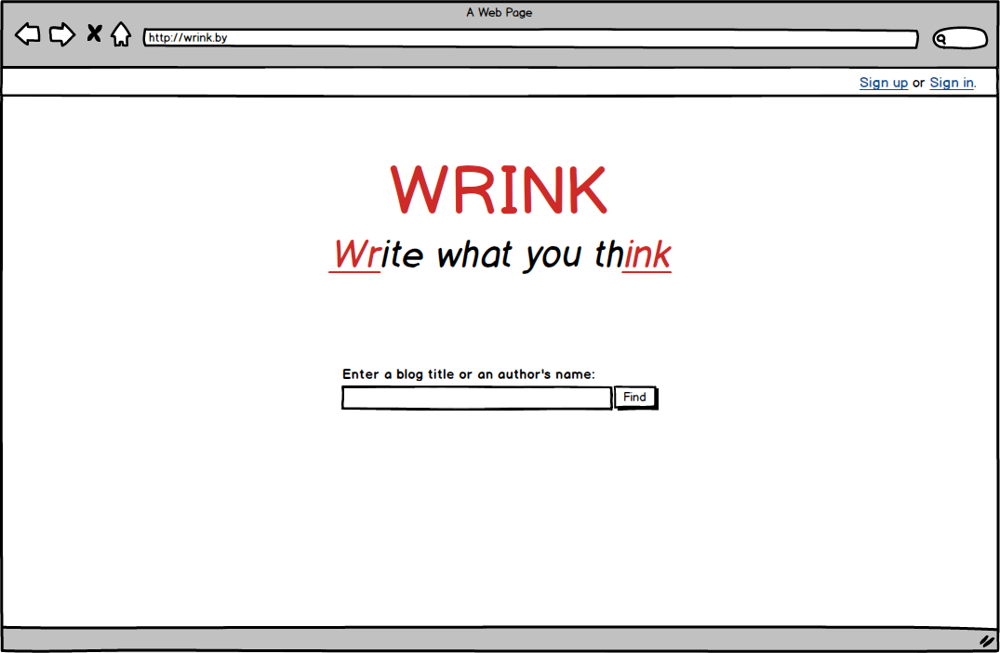
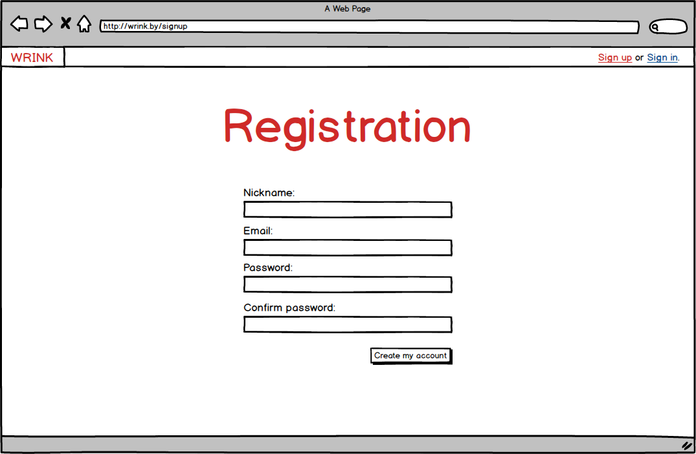
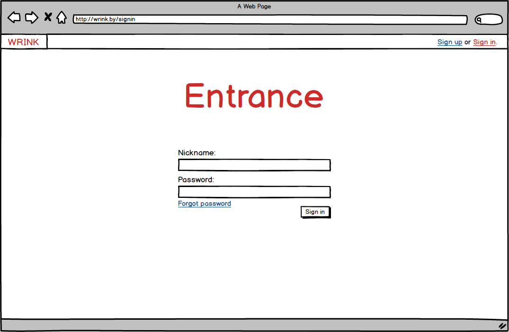
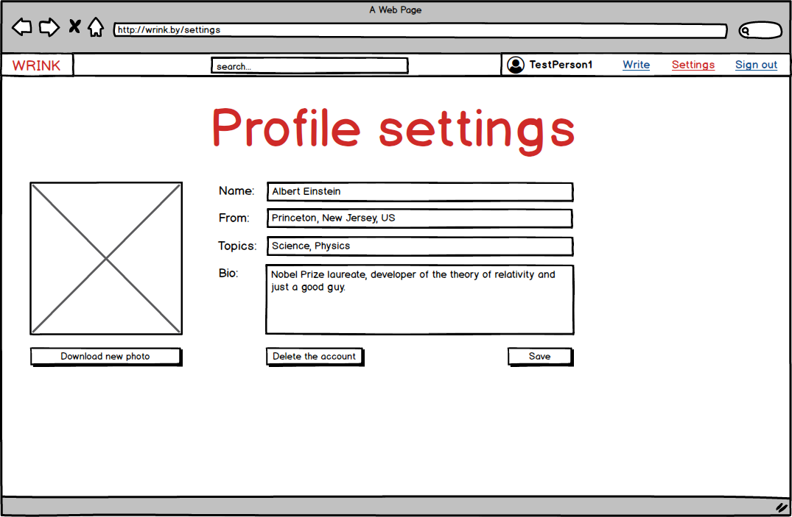
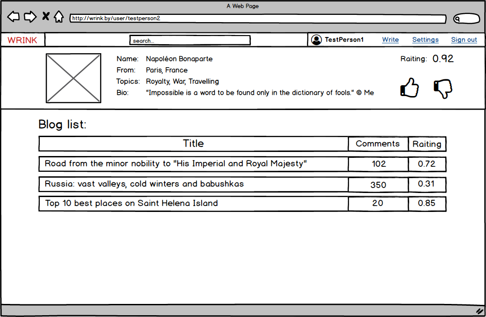
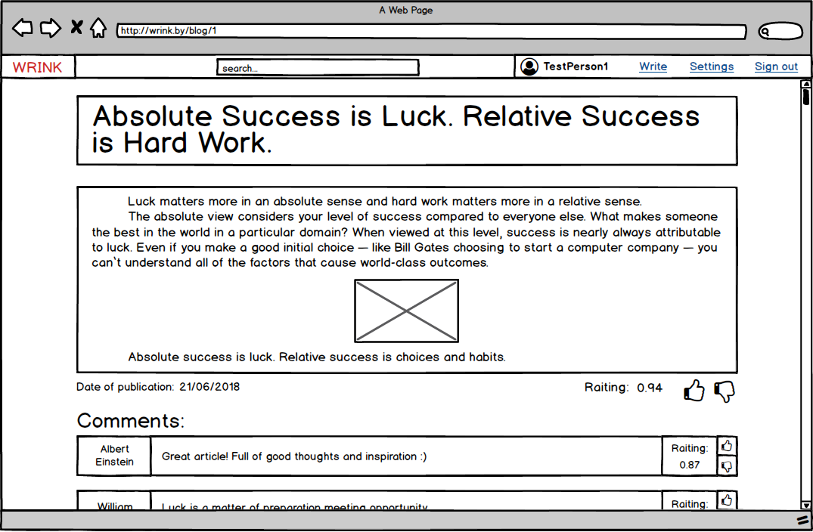

# Project requirements
### Table of Contents
  1. [Introduction](#1)  
    1.1 [Purpose](#1.1)  
    1.2 [Business requirements](#1.2)  
      1.2.1 [Overview](#1.2.1)  
      1.2.2 [Project bounds](#1.2.2)  
    1.3 [Analogs](#1.3)  
  2. [User requirements](#2)  
    2.1 [Program interfaces](#2.1)  
    2.2 [User interface](#2.2)  
    2.3 [User characteristics](#2.3)  
      2.3.1 [User classes](#2.3.1)  
      2.3.2 [Application audience](#2.3.2)  
    2.4 [Assumptions and dependencies](#2.4)  
  3. [System requirements](#3)  
    3.1 [Functional requirements](#3.1)  
      3.1.1 [Sign in](#3.1.1)  
      3.1.2 [User profile settings](#3.1.2)  
      3.1.3 [User interaction](#3.1.3)  
      3.1.4 [Search request](#3.1.4)  
      3.1.5 [Writing an article](#3.1.5)  
    3.2 [Non-functional requirements](#3.2)  
      3.2.1 [Quality attributes](#3.2.1)  
      3.2.2 [Business rules](#3.2.2)  
      3.2.3 [External interface](#3.2.3)  
      3.2.4 [Constraints](#3.2.4)  

### 1 Introduction 
#### 1.1 Purpose 

This document describes functional and non-functional requirements to website "Wrink". It's purposed for all interested people: customers (to know how they were understood), developers (to know what exactly they have to do), testers (to know what they have to check), users (to know which possibilities are going to provide) and others.

#### 1.2 Business requirements 
##### 1.2.1 Overview 

Today, in 21 century, people don't miss the opportunity share different news and their opinions with everybody, tell stories. The Internet lets do it in a few clicks, getting a wider audience. Also people have a need to speak out, express own emotions. This is why it was set the task which is to develop the project that gets people a blog site. Blog is a website whose main content is regularly added posts containing text, images and similar elements.

##### 1.2.2 Project bounds 

Application lets users create own blog where they're able to place articles and read other pages. As well signed up users can write comments, rate users' articles and comments.

#### 1.3 Analogs 
Main analogs of development project are:
1. [Blogger](https://www.blogger.com) — simple in use, but blog functionality is limited (for example, there's no text redactor).
2. [LiveJournal](https://www.livejournal.com) — similar to social network, but functionality is also limited, there is a lot of publicity.
3. [Tumblr](https://www.tumblr.com) — high threshold of entry because of wide possibilities in blog view setting.

### 2. System requirements 
#### 2.1 Program interfaces 
  - Must be implemented a text editor with a choice of alignment, style, and the addition of images.
  - Must be implemented search system blogs and users.
  - Must be implemented user page with a info editing possibility.

#### 2.2 User interface 
- Main page
  
- Sign up page
  
- Sign in page
  
- Profile setting page
  
- User profile page
  
- Article page
  
- Article writing page
  

#### 2.3 User characteristics 
##### 2.3.1 User classes 
| Class | Description |
|:---|:---|
| Anonymous users | Users that are not signed up or signed in. They can use only search, watch user profiles and read articles. Rating and commenting is not available. |
| Sign in users | Signed in users. They have access to whole functionality within their profile (including deletion). |
| Administrators | Users that signed up in a special way and have access to all information. They are needed for filtering information that is not corresponding with business rules. |

##### 2.3.2 Application audience 

The audience is people of any age and level of education. It is divided into readers and writers. If the reader can be anyone, then active and creative individuals will become writers.

#### 2.4 Assumptions and dependencies 

The application works only with a browser. It is also necessary to take into account that if the project is launched with a Belarusian domain (.by), then due to amendments to the legislation, the project would have more information fields during registration (for example, real name and phone number) in order to identify users.

### 3 System requirements 
#### 3.1 Functional requirements 
##### 3.1.1 Sign in 
**Description.** The user has the opportunity to use the application without creating his own profile or signing into his account.

| Function | Requirements |
|:---|:---|
| Sign in to the application without creating your own profile | The application must allow the user to log in to the application anonymously |
| Register a new user | The application must ask the user to enter a name and password to create an account. The user must either enter or cancel the action |
| * A user with the same name exists * | * The application must notify the user about the registration error and request input * |
| Registered user login to the application | The application must ask the user to enter a name and password for authorization. If the data is entered correctly, the user gets access to the functionality, otherwise the application must request re-entry |

##### 3.1.2 User profile settings 
** Description. ** Registered user has the ability to edit their personal information.

| Function | Requirements |
|: --- |: --- |
| Change personal information | The application must provide the user with the opportunity to change the name, address, list of topics, biography and photo |
| Delete articles | The application must allow the user to delete his articles |
| Delete comments | The application must allow the user to delete his comments |
| Delete profile | The application must provide the user with the ability to completely remove the blog |

##### 3.1.3 User interaction 
** Description. ** After signing in, users can interact with each other.

| Function | Requirements |
|: --- |: --- |
| Leave comment | The application must allow authorized users to leave comments under any blog entries |
| Rate comment | The application must provide an authorized user the ability to rate comments from other users |
| Rate profile | The application must provide an authorized user the ability to rate the pages of other users |
| * Rate your comments and your profile * | * The application must notify the user that you can not evaluate yourself * |
| * Rate again * | * The application must notify the user that he has already rated this comment or blog * |

##### 3.1.4 Search request 
** Description. ** Any user has the opportunity to send a search query.

** Requirement. ** The application must provide matches for the names of articles and profiles with the search request.

##### 3.1.5 Writing an article 
** Description. ** Signed in users can write and publish articles.

** Requirement. ** The application must allow you to write an article using a text editor and publish it.

#### 3.2 Non-functional requirements 
##### 3.2.1 Quality attributes 

 The project must be small (have less than 10 types of pages), convenient (access to the main functions of the application for no more than two operations) and manageable (the user can cancel all his actions).

##### 3.2.2 Business rules 

The project must be able to remove from the site information that violates the laws of countries.

##### 3.2.3 External interface 
The site must:
- be designed in the same style;
- support the use of the keyboard not only for entering text, but also for selecting operations.

##### 3.2.4 Constraints 

All information (user profiles, articles, comments) is stored in a database.

