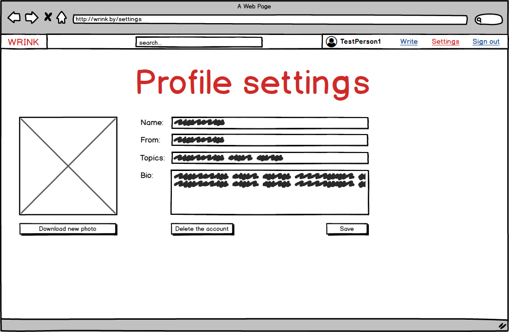
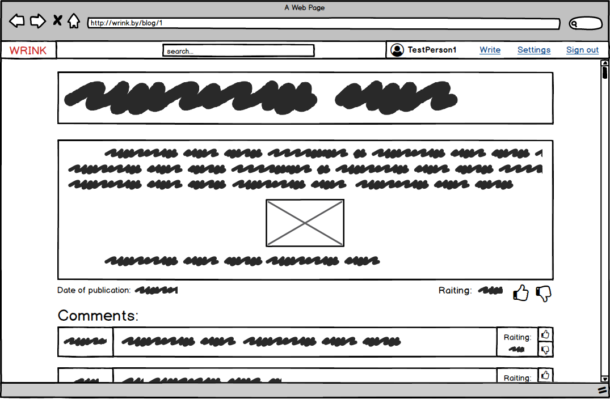

# Требования к проекту
### Содержание
  1 [Введение](#1)  
    1.1 [Назначение](#1.1)  
    1.2 [Бизнес-требования](#1.2)  
      1.2.1 [Исходные данные](#1.2.1)  
      1.2.2 [Границы проекта](#1.2.2)  
    1.3 [Аналоги](#1.3)  
  2 [Требования пользователей](#2)  
    2.1 [Программные интерфейсы](#2.1)  
    2.2 [Интерфейс пользователя](#2.2)  
    2.3 [Характеристики пользователей](#2.3)  
      2.3.1 [Классы пользователей](#2.3.1)  
      2.3.2 [Аудитория приложения](#2.3.2)  
    2.4 [Предположения и зависимости](#2.4)  
  3 [Системные требования](#3)  
    3.1 [Функциональные требования](#3.1)  
      3.1.1 [Вход пользователя в приложение](#3.1.1)  
      3.1.2 [Настройка профиля пользователя](#3.1.2)  
      3.1.3 [Взаимодействие пользователей](#3.1.3)  
      3.1.4 [Поисковый запрос](#3.1.4)  
      3.1.5 [Создание статьи](#3.1.5)  
    3.2 [Нефункциональные требования](#3.2)  
      3.2.1 [Атрибуты качества](#3.2.1)  
      3.2.1.1 [Внешние критерии](#3.2.1.1)  
      3.2.1.2 [Внутренние критерии](#3.2.1.2)  

### 1 Введение 
#### 1.1 Назначение 

Данный документ описывает функциональные и нефункциональные требования к веб-сайту "Wrink". Он предназначен для всех заинтересованных лиц (заказчиков, разработчиков, тестировщиков, пользователей и других).

#### 1.2 Бизнес-требования 
##### 1.2.1 Исходные данные 

Сегодня, в 21-м веке, люди не упускают возможности поделиться со всеми различными новостями, своим мнением после очередного события, рассказать историю. Интернет позволяет сделать это в пару кликов, к тому же расширяя аудиторию до огромных масштабов. Также у людей есть потребность высказаться, выразить свои эмоции и впечатления. Желая угодить всем перечисленным, была поставлена задача, которая заключается в разработке и предоставлении пользователям блог-площадки. Блог — это веб-сайт, основное содержимое которого — регулярно добавляемые записи, содержащие текст, изображения и подобные им элементы.

##### 1.2.2 Границы проекта 

Приложение позволит создать свой блог, на котором можно размещать собственные записи, и просматривать чужие страницы. Зарегистрированные пользователи смогут также оставлять комменатарии, оценивать статьи и комментарии других посетителей.

#### 1.3 Аналоги 
Главными аналогами разрабатываемого проекта являются:
1. [Blogger](https://www.blogger.com) — прост в использовании, но функциональность блогов ограничена (нет редактора текста).
2. [LiveJournal](https://www.livejournal.com) — имеются признаки социальной сети, но набор функций для ведения блога также ограничен, большое количество рекламы.
3. [Tumblr](https://www.tumblr.com) — широкие возможности по настройке облика, но из-за этого большой порог вхождения.

### 2. Требования пользователей 
#### 2.1 Программные интерфейсы 
  - Должен быть реализован редактор текста с выбором выравнивания, начертания и добавлением изображений.
  - Должна быть реализована система поиска блогов и пользователей.
  - Должна быть реализована персональная страница пользователя с возможностью редактирования информации.

#### 2.2 Интерфейс пользователя 
- Главный экран приложения
  
- Страница для регистрации пользователя
  
- Страница для авторизации пользователя
  
- Страница настройки профиля пользователя
  
- Страница блога
  
- Страница создания блога
  

#### 2.3 Характеристики пользователей 
##### 2.3.1 Классы пользователей 
| Класс | Описание |
|:---|:---|
| Анонимные пользователи | Пользователи, которые не зарегистрированы в приложении либо не авторизованы. Могут только использовать поиск, просматривать профили и читать записи. Возможности оценки и оставления комментариев не доступны |
| Зарегистрированные пользователи | Авторизованные пользователи. Имеют доступ к полному функционалу в рамках своего профиля (в том числе его удаление) |
| Администраторы | Пользователи, которые авторизовались специальным способом и имеют доступ ко всей информации. Необходимы для удаления пользователей или записей, не соответствующих бизнес-правилам |

##### 2.3.2 Аудитория приложения 

Аудитория представляет из себя людей любого возраста и уровня образования. Она делится на читателей и писателей. Если читателем может быть кто угодно, то писателями станут активные и творческие личности. 

#### 2.4 Предположения и зависимости 
Приложение работает только при наличии браузера и постоянного подключения к интернету.

### 3 Системные требования 
#### 3.1 Функциональные требования 
##### 3.1.1 Вход пользователя в приложение 
**Описание.** Пользователь имеет возможность использовать приложение без создания собственного профиля либо войдя в свою учётную запись.

| Функция | Требования |
|:---|:---|
| Вход в приложение без создания собственного профиля | Приложение должно предоставить пользователю возможность войти в приложение анонимно |
| Регистрация нового пользователя | Приложение должно запросить у пользователя ввести имя и пароль для создания учётной записи. Пользователь должен либо ввести, либо отменить действие |
| *Пользователь с таким именем существует* | *Приложение должно известить пользователя об ошибке регистрации и запросить ввод* |
| Вход зарегистрированного пользователя в приложение | Приложение должно запросить у пользователя ввести имя и пароль для авторизации. Если данные введены верно, то пользователю разблокируется функционал, в противном случае приложение должно запросить повторный ввод |

##### 3.1.2 Настройка профиля пользователя 
**Описание.** Зарегистрированный пользователь имеет возможность редактировать свою личную информацию.

| Функция | Требования |
|:---|:---|
| Изменение личной информации | Приложение должно предоставить пользователю возможность изменить имя, адрес, список тем, биографию и фотографию |
| Удаление записи | Приложение должно позволять пользователю удалять его записи |
| Удаление профиля | Приложение должно предоставить пользователю возможность полного удаления блога |

##### 3.1.3 Взаимодействие пользователей 
**Описание.** После входа пользователи могут взаимодействовать друг с другом.

| Функция | Требования |
|:---|:---|
| Оставление комментариев | Приложение должно позволять авторизованным пользователям оставлять комментарии под записями любых блогов |
| Оценка комментариев | Приложение должно предоставить авторизованному пользователю возможность оценивать комментарии других пользователей |
| Оценка профиля | Приложение должно предоставить авторизованному пользователю возможность оценивать страницы других пользователей |
| *Оценка своих комментариев и своего профиля* | *Приложение должно известить пользователя о том, что самого себя оценивать нельзя* |
| *Повторная оценка* | *Приложение должно известить пользователя о том, что он уже оценивал этот комментарий или блог* |

##### 3.1.4 Поисковый запрос 
**Описание.** Любой пользователь имеет возможность оправить поисковый запрос.

**Требование.** Приложение должно предоставить найденные совпадения по названиям статей и профилей с поисковым запросом.

##### 3.1.5 Создание статьи 
**Описание.** Зарегистрированные пользователи имеют возможность писать и публиковать статьи.

**Требование.** Приложение должно позволить написать статью с использованием редактора текста и опубликовать её.

#### 3.2 Нефункциональные требования 
##### 3.2.1 Атрибуты качества 
##### 3.2.1.1 Внешние критерии 
1. Доступ к основным функциям приложения не более чем за две операции. 
2. Юзабилити.
##### 3.2.1.2 Внутренние критерии 
1. Быстрая обработка запросов пользователя. 
2. Малое количество страниц.
